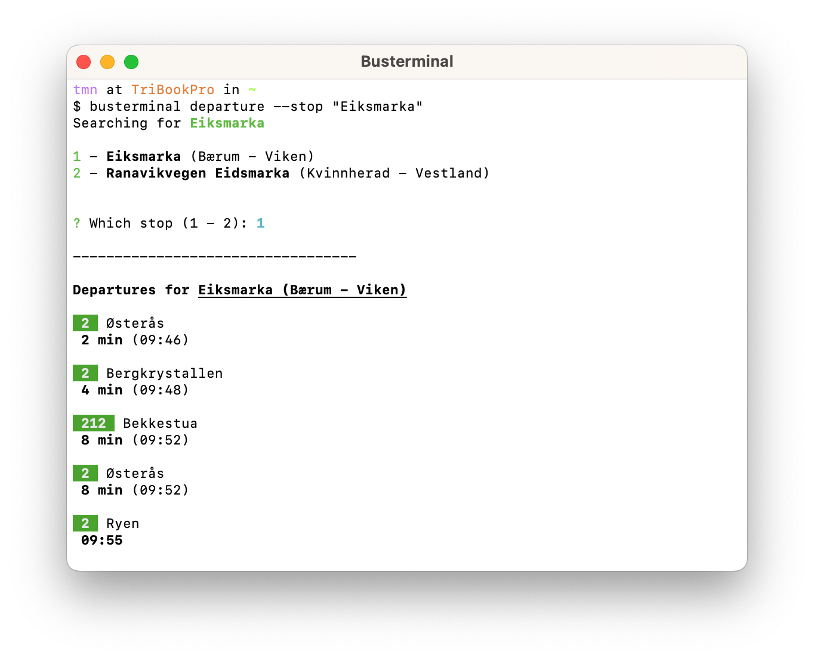
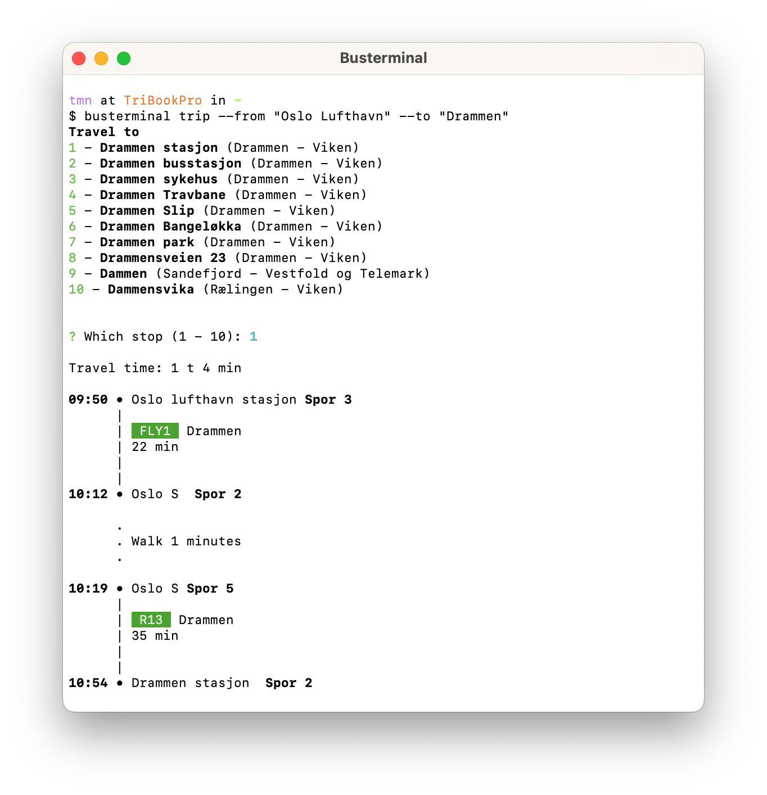

# busterminal

busterminal is a **BLAZINGLY FAST**, **RUST-BASED** CLI for.. jk. It's just a simple CLI for retrieving information from the public transportation system in Norway



## Installation

Install **busterminal** using cargo:

```bash
$ cargo install busterminal
```

## Usage

Get departures from stops:

```bash
$ busterminal departure --stop "Tyholt"
```

Plan a trip:

```bash
$ busterminal trip --from "Oslo S" --to "Oslo Gardemoen Lufthavn"
```



<sub>This project is not affiliated with EnTur in any way.</sub>
